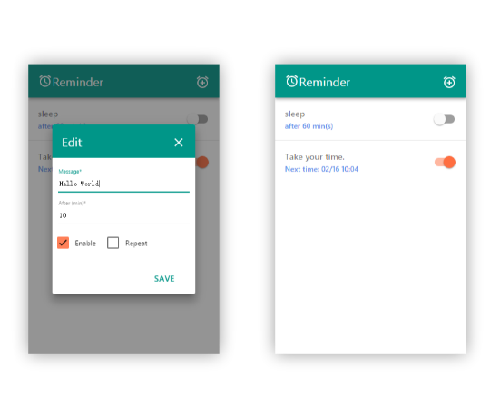

# Reminder

[](https://github.com/facebook/react)
[](https://github.com/callemall/material-ui)

>Build a other extension to learn react.

## Feature

 - just a alarm clock.

## Development

```bash
# install modules
$ npm install
# copy assets to ./dev and run webpack-dev-server
$ npm run dev
```

## Screenshot



## Install

[](https://chrome.google.com/webstore/detail/nhinihlcaopodengnofmddnibmjiahep)

## License

MIT [LICENSE](./LICENSE)
